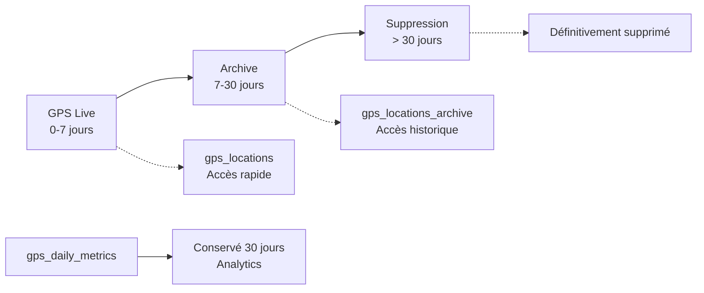

# 🚀 RENDER CRON TAB DEPLOYMENT GUIDE

## **GPS Daily Metrics Fix + Advanced Cleanup System**

> **Objectif** : Corriger le bug des daily metrics bloquées au 30 juin + déployer un système de nettoyage automatique des données GPS avec archivage intelligent.

---

## **📋 PROBLÈME IDENTIFIÉ**

### **🔍 Diagnostic**
- ❌ **`gps_daily_metrics`** : Bloquée au 30 juin 2025 (pas de nouvelles données)
- ✅ **`gps_locations`** : Fonctionne correctement (données du 18 juillet)
- 🐛 **Cause** : Erreur de conversion de type `DECIMAL → INTEGER` dans `updateDailyMetrics()`

### **💥 Erreur Technique**
```
❌ Error: invalid input syntax for type integer: "38.8333166666666667"
```

La fonction `updateDailyMetrics()` calcule des décimales mais la base attend des entiers pour les champs temps.

---

## **🚨 DÉPLOIEMENT URGENCE (Priorité 1)**

### **ÉTAPE 1 : Fix Immédiat Base de Données**

#### **1.1 - Script SQL de Correction**
```sql
-- =====================================================
-- PRODUCTION FIX: GPS DAILY METRICS (CORRECTED)
-- Fix the data type conversion issue and window function error
-- =====================================================

-- 1. Check current state
SELECT 'Current daily metrics (last 7 days):' as status;
SELECT tracking_date, COUNT(*) as livreur_count, SUM(total_distance_km) as total_distance
FROM gps_daily_metrics 
WHERE tracking_date >= CURRENT_DATE - INTERVAL '7 days'
GROUP BY tracking_date
ORDER BY tracking_date DESC;

-- 2. Update the calculate_daily_metrics function with proper structure
CREATE OR REPLACE FUNCTION calculate_daily_metrics(target_date DATE DEFAULT CURRENT_DATE)
RETURNS INTEGER AS $$
DECLARE
    livreur_record RECORD;
    total_processed INTEGER := 0;
    daily_stats RECORD;
    accuracy_threshold_meters INTEGER := 100;
BEGIN
    FOR livreur_record IN 
        SELECT id, username FROM users WHERE role = 'LIVREUR' AND is_active = true
    LOOP
        WITH ordered_positions AS (
            SELECT 
                latitude, longitude, timestamp, speed, accuracy,
                LAG(latitude) OVER (ORDER BY timestamp) as prev_lat,
                LAG(longitude) OVER (ORDER BY timestamp) as prev_lng
            FROM gps_locations 
            WHERE livreur_id = livreur_record.id 
              AND DATE(timestamp) = target_date
              AND (accuracy IS NULL OR accuracy <= accuracy_threshold_meters)
            ORDER BY timestamp ASC
        ),
        position_analysis AS (
            SELECT 
                COUNT(*) as position_count,
                MIN(timestamp) as start_time,
                MAX(timestamp) as end_time,
                SUM(CASE 
                    WHEN prev_lat IS NOT NULL AND prev_lng IS NOT NULL 
                    THEN LEAST(2000,
                        calculate_gps_distance(prev_lat, prev_lng, latitude, longitude) / 1000.0)
                    ELSE 0 
                END) as total_distance_km,
                AVG(NULLIF(speed * 3.6, 0)) as avg_speed_kmh,
                MAX(speed * 3.6) as max_speed_kmh,
                COUNT(CASE WHEN speed IS NOT NULL AND speed < 2 THEN 1 END) as slow_points
            FROM ordered_positions
        )
        SELECT 
            COALESCE(pa.total_distance_km, 0) as total_distance_km,
            COALESCE(EXTRACT(EPOCH FROM (pa.end_time - pa.start_time)) / 60.0, 0) as total_time_minutes,
            COALESCE(pa.avg_speed_kmh, 0) as average_speed_kmh,
            COALESCE(pa.max_speed_kmh, 0) as max_speed_kmh,
            GREATEST(1, pa.slow_points / 10) as estimated_stops,
            CASE 
                WHEN pa.avg_speed_kmh > 0 AND pa.avg_speed_kmh <= 50
                THEN LEAST(100, GREATEST(0, (pa.avg_speed_kmh / 25.0) * 100))
                WHEN pa.avg_speed_kmh > 50
                THEN GREATEST(0, 100 - (pa.avg_speed_kmh - 50) * 2)
                ELSE 50 
            END as fuel_efficiency_score,
            CASE 
                WHEN pa.total_distance_km > 0.05
                THEN LEAST(100, GREATEST(0, (pa.total_distance_km * 15) + 25))
                ELSE 0 
            END as route_efficiency_score
        INTO daily_stats
        FROM position_analysis pa;

        IF daily_stats.total_distance_km > 0.01 OR daily_stats.total_time_minutes > 5 THEN
            INSERT INTO gps_daily_metrics (
                livreur_id, tracking_date, total_distance_km, total_time_minutes,
                active_time_minutes, average_speed_kmh, max_speed_kmh, total_stops,
                longest_stop_minutes, fuel_efficiency_score, route_efficiency_score
            ) VALUES (
                livreur_record.id, target_date, 
                ROUND(daily_stats.total_distance_km::numeric, 2),
                ROUND(daily_stats.total_time_minutes::numeric)::INTEGER,
                ROUND(daily_stats.total_time_minutes::numeric * 0.8)::INTEGER,
                ROUND(daily_stats.average_speed_kmh::numeric, 2),
                ROUND(daily_stats.max_speed_kmh::numeric, 2),
                daily_stats.estimated_stops,
                ROUND(daily_stats.total_time_minutes::numeric / 4)::INTEGER,
                ROUND(daily_stats.fuel_efficiency_score::numeric, 2),
                ROUND(daily_stats.route_efficiency_score::numeric, 2)
            ) ON CONFLICT (livreur_id, tracking_date) 
            DO UPDATE SET
                total_distance_km = EXCLUDED.total_distance_km,
                total_time_minutes = EXCLUDED.total_time_minutes,
                active_time_minutes = EXCLUDED.active_time_minutes,
                average_speed_kmh = EXCLUDED.average_speed_kmh,
                max_speed_kmh = EXCLUDED.max_speed_kmh,
                total_stops = EXCLUDED.total_stops,
                longest_stop_minutes = EXCLUDED.longest_stop_minutes,
                fuel_efficiency_score = EXCLUDED.fuel_efficiency_score,
                route_efficiency_score = EXCLUDED.route_efficiency_score;

            total_processed := total_processed + 1;
        END IF;
    END LOOP;

    RETURN total_processed;
END;
$$ LANGUAGE plpgsql;

-- 3. Regenerate metrics for the last 7 days
SELECT 'Regenerating daily metrics...' as status;
SELECT calculate_daily_metrics(CURRENT_DATE) as today_processed;
SELECT calculate_daily_metrics(CURRENT_DATE - 1) as yesterday_processed;
SELECT calculate_daily_metrics(CURRENT_DATE - 2) as day_2_processed;
SELECT calculate_daily_metrics(CURRENT_DATE - 3) as day_3_processed;
SELECT calculate_daily_metrics(CURRENT_DATE - 4) as day_4_processed;
SELECT calculate_daily_metrics(CURRENT_DATE - 5) as day_5_processed;
SELECT calculate_daily_metrics(CURRENT_DATE - 6) as day_6_processed;

-- 4. Verify the results
SELECT 'Results - New daily metrics:' as status;
SELECT 
    dm.tracking_date, 
    u.username, 
    dm.total_distance_km, 
    dm.total_time_minutes, 
    dm.average_speed_kmh,
    dm.route_efficiency_score
FROM gps_daily_metrics dm
JOIN users u ON dm.livreur_id = u.id
WHERE dm.tracking_date >= CURRENT_DATE - INTERVAL '7 days'
  AND u.role = 'LIVREUR'
ORDER BY dm.tracking_date DESC, u.username;

-- 5. Summary count
SELECT 'Summary - Metrics count by date:' as status;
SELECT tracking_date, COUNT(*) as metrics_count
FROM gps_daily_metrics 
WHERE tracking_date >= CURRENT_DATE - INTERVAL '7 days'
GROUP BY tracking_date
ORDER BY tracking_date DESC;
```

#### **1.2 - Commande d'Exécution**
```bash
# Connectez-vous à votre base PROD et exécutez le SQL ci-dessus
psql $DATABASE_URL

# Ou via fichier
psql $DATABASE_URL -f fix_production_daily_metrics.sql
```

### **ÉTAPE 2 : Fix Code Application**

#### **2.1 - Modifier `backend/controllers/gpsController.js`**

**Localiser la fonction `updateDailyMetrics` et remplacer :**

```javascript
// ❌ ANCIEN CODE (ligne ~155)
await db.query(upsertQuery, [
  livreur_id,
  today,
  metrics.total_distance_km,
  metrics.total_time_minutes,           // ← PROBLÈME ICI
  metrics.total_time_minutes * 0.8,    // ← PROBLÈME ICI
  metrics.average_speed_kmh,
  metrics.max_speed_kmh,
  metrics.fuel_efficiency_score,
  metrics.route_efficiency_score
]);

// ✅ NOUVEAU CODE (CORRECTED)
await db.query(upsertQuery, [
  livreur_id,
  today,
  parseFloat(metrics.total_distance_km),
  Math.round(parseFloat(metrics.total_time_minutes)),     // ✅ Conversion INTEGER
  Math.round(parseFloat(metrics.total_time_minutes) * 0.8), // ✅ Conversion INTEGER
  parseFloat(metrics.average_speed_kmh),
  parseFloat(metrics.max_speed_kmh),
  parseFloat(metrics.fuel_efficiency_score),
  parseFloat(metrics.route_efficiency_score)
]);
```

#### **2.2 - Validation Immédiate**
```sql
-- Après déploiement, vérifier que les nouvelles positions GPS génèrent les metrics
SELECT * FROM gps_daily_metrics 
WHERE tracking_date = CURRENT_DATE;
```

---

## **🧹 SYSTÈME DE NETTOYAGE AVANCÉ (Priorité 2)**

### **ARCHITECTURE DU SYSTÈME**



### **ÉTAPE 3 : Ajouter les Scripts de Nettoyage**

#### **3.1 - Créer le dossier scripts**
```bash
mkdir -p scripts
```

#### **3.2 - Fichier `scripts/cleanup-gps-advanced.js`**
> ✅ **Déjà créé** - Script principal avec archivage intelligent

**Fonctionnalités :**
- 🔍 Vérification cohérence données
- 📦 Archivage automatique (7-30 jours)
- 🗑️ Suppression intelligente (> 30 jours)
- 🔧 Optimisation conditionnelle (VACUUM_THRESHOLD)
- 🧪 Mode DRY_RUN pour tests
- 📊 Logs détaillés et statistiques

#### **3.3 - Fichier `scripts/cleanup-archive.js`**
> ✅ **Déjà créé** - Nettoyage mensuel des archives

**Fonctionnalités :**
- 🗂️ Nettoyage archive mensuel (> 30 jours)
- 📊 Statistiques archive
- 🔧 Optimisation archive si nécessaire

### **ÉTAPE 4 : Configuration Render Cron Jobs**

#### **4.1 - Ajouter à votre `render.yaml`**

```yaml
services:
  # ... vos services existants (web app) ...

  # ===================================
  # NOUVEAU: SYSTÈME GPS CLEANUP AVANCÉ
  # ===================================
  
  # Nettoyage GPS quotidien
  - type: cron
    name: gps-cleanup-advanced
    runtime: node
    schedule: '0 2 * * *'           # 02:00 UTC tous les jours
    buildCommand: 'npm ci'
    startCommand: 'node scripts/cleanup-gps-advanced.js'
    envVars:
      - key: DATABASE_URL
        fromDatabase:
          name: mlc-db              # ⚠️ REMPLACER par votre nom de DB Render
          property: connectionString
      - key: NODE_ENV
        value: production
      
      # === CONFIGURATION GPS CLEANUP ===
      - key: GPS_RETENTION_DAYS
        value: '7'                  # Conserver 7 jours dans table principale
      - key: GPS_ARCHIVE_ENABLED
        value: 'true'              # Activer l'archivage
      - key: GPS_ARCHIVE_DAYS
        value: '30'                # Durée archive avant suppression finale
      - key: VACUUM_THRESHOLD
        value: '1000'              # Optimiser base si > 1000 suppressions
      - key: DRY_RUN
        value: 'false'             # false = production, true = test
      # - key: CLEANUP_WEBHOOK_URL  # Optionnel: notifications Slack/Discord
      #   value: 'https://hooks.slack.com/...'

  # Nettoyage archive mensuel (OPTIONNEL mais recommandé)
  - type: cron
    name: gps-archive-cleanup
    runtime: node
    schedule: '0 1 1 * *'          # 1er du mois à 01:00 UTC
    buildCommand: 'npm ci'
    startCommand: 'node scripts/cleanup-archive.js'
    envVars:
      - key: DATABASE_URL
        fromDatabase:
          name: mlc-db              # ⚠️ REMPLACER par votre nom de DB Render
          property: connectionString
      - key: NODE_ENV
        value: production
```

#### **4.2 - Points Critiques Configuration**

| Variable | Valeur | Description |
|----------|--------|-------------|
| `GPS_RETENTION_DAYS` | `'7'` | Données "chaudes" conservées 7 jours |
| `GPS_ARCHIVE_DAYS` | `'30'` | Archive totale 30 jours |
| `VACUUM_THRESHOLD` | `'1000'` | Optimisation si > 1000 suppressions |
| `DRY_RUN` | `'false'` | Production (true = mode test) |

#### **4.3 - VACUUM_THRESHOLD Expliqué**

```javascript
/**
 * VACUUM_THRESHOLD : Seuil de déclenchement de l'optimisation PostgreSQL
 * 
 * À quoi ça sert ?
 * - VACUUM récupère l'espace disque des lignes supprimées
 * - Met à jour les statistiques de la table pour l'optimiseur
 * - Améliore les performances des requêtes futures
 * 
 * Pourquoi un seuil ?
 * - VACUUM est coûteux en ressources (CPU, I/O)
 * - Inutile pour de petites suppressions (< 1000 lignes)
 * - Évite de surcharger la base pour rien
 * 
 * Exemple avec votre config (5min = ~2000 positions/jour) :
 * - Suppressions quotidiennes : ~2000 positions
 * - 2000 > 1000 (VACUUM_THRESHOLD)
 * - → VACUUM automatique chaque nuit ✅
 */
```

---

## **📋 SÉQUENCE DE DÉPLOIEMENT**

### **⏰ Ordre d'Exécution Recommandé**

| Étape | Action | Durée | Priorité |
|-------|---------|-------|----------|
| **1** | Exécuter SQL fix daily metrics | 2 min | 🔥 URGENT |
| **2** | Modifier `gpsController.js` | 1 min | 🔥 URGENT |
| **3** | Commit + Push code | 1 min | 🔥 URGENT |
| **4** | Ajouter scripts cleanup | 5 min | 📁 NORMAL |
| **5** | Mettre à jour `render.yaml` | 5 min | 📁 NORMAL |
| **6** | Déploiement final | Auto | 🚀 AUTO |
| **7** | Tests et vérifications | 10 min | ✅ VALIDATION |

### **🚀 Commandes de Déploiement**

```bash
# === PHASE 1: FIX URGENT ===
# 1. Fix base de données
psql $DATABASE_URL -f fix_production_daily_metrics.sql

# 2. Modifier le code gpsController.js (voir section 2.1)

# 3. Commit urgent
git add backend/controllers/gpsController.js
git commit -m "🚨 URGENT: Fix GPS daily metrics data type conversion"
git push origin main

# === PHASE 2: SYSTÈME NETTOYAGE ===
# 4. Ajouter les scripts
git add scripts/cleanup-gps-advanced.js scripts/cleanup-archive.js

# 5. Mettre à jour render.yaml (voir section 4.1)
git add render.yaml

# 6. Commit final
git commit -m "✨ Add advanced GPS cleanup system with archiving"
git push origin main

# 7. Render redéploiera automatiquement
```

---

## **✅ VÉRIFICATIONS POST-DÉPLOIEMENT**

### **🔍 Test 1 : Daily Metrics Corrigées**

```sql
-- Doit montrer des données récentes (pas seulement juin 30)
SELECT 
    dm.tracking_date, 
    COUNT(*) as livreur_count,
    SUM(dm.total_distance_km) as total_distance,
    AVG(dm.route_efficiency_score) as avg_efficiency
FROM gps_daily_metrics dm
WHERE dm.tracking_date >= CURRENT_DATE - INTERVAL '7 days'
GROUP BY dm.tracking_date
ORDER BY dm.tracking_date DESC;

-- Résultat attendu : Lignes pour juillet 17, 18, etc.
```

### **🔍 Test 2 : Cron Jobs Actifs**

1. **Render Dashboard** → **Services**
2. Vérifier services cron :
   - ✅ `gps-cleanup-advanced` : Status **Active**
   - ✅ `gps-archive-cleanup` : Status **Active**
3. **Logs** → Vérifier aucune erreur au démarrage

### **🔍 Test 3 : Cleanup en Mode Test**

```bash
# Test manuel sans modification (DRY_RUN)
DRY_RUN=true GPS_RETENTION_DAYS=7 node scripts/cleanup-gps-advanced.js

# Résultat attendu : 
# - "🧪 DRY RUN - AUCUNE MODIFICATION"
# - Statistiques des données qui seraient traitées
# - Aucune erreur
```

### **🔍 Test 4 : Métriques Temps Réel**

```bash
# Déclencher une position GPS et vérifier que les metrics se créent
# Via votre app mobile ou API directe

# Puis vérifier :
```

```sql
SELECT * FROM gps_daily_metrics 
WHERE tracking_date = CURRENT_DATE 
  AND livreur_id IN (
    SELECT DISTINCT livreur_id FROM gps_locations 
    WHERE timestamp >= NOW() - INTERVAL '1 hour'
  );

-- Résultat attendu : Metrics mises à jour récemment
```

---

## **📊 MONITORING ET MAINTENANCE**

### **📈 Métriques à Surveiller**

#### **1. Taille des Tables**
```sql
SELECT 
  schemaname,
  tablename,
  pg_size_pretty(pg_total_relation_size(schemaname||'.'||tablename)) as size,
  pg_size_pretty(pg_relation_size(schemaname||'.'||tablename)) as table_size
FROM pg_tables 
WHERE tablename LIKE 'gps_%' 
ORDER BY pg_total_relation_size(schemaname||'.'||tablename) DESC;
```

#### **2. Efficacité du Nettoyage**
```sql
-- Vérifier que les données anciennes sont bien supprimées
SELECT 
  DATE(timestamp) as date,
  COUNT(*) as positions_count,
  AVG(accuracy) as avg_accuracy
FROM gps_locations 
GROUP BY DATE(timestamp)
ORDER BY date DESC
LIMIT 10;

-- Résultat attendu : Seulement 7 derniers jours
```

#### **3. Performance Archive**
```sql
SELECT 
  COUNT(*) as archived_positions,
  MIN(timestamp) as oldest_archived,
  MAX(timestamp) as newest_archived,
  pg_size_pretty(pg_total_relation_size('gps_locations_archive')) as archive_size
FROM gps_locations_archive;
```

### **🔧 Configuration Adaptable**

#### **Environnements Différents**
```yaml
# DEVELOPMENT (plus de données conservées)
- key: GPS_RETENTION_DAYS
  value: '14'                    # 2 semaines
- key: VACUUM_THRESHOLD  
  value: '500'                   # Seuil plus bas

# PRODUCTION STANDARD (recommandé)
- key: GPS_RETENTION_DAYS
  value: '7'                     # 1 semaine
- key: VACUUM_THRESHOLD
  value: '1000'                  # Équilibré

# PRODUCTION OPTIMISÉE (moins de stockage)
- key: GPS_RETENTION_DAYS
  value: '3'                     # 3 jours seulement
- key: VACUUM_THRESHOLD
  value: '2000'                  # Seuil plus élevé
```

### **📅 Planning Maintenance**

| Fréquence | Action | Responsable |
|-----------|---------|-------------|
| **Quotidien** | Vérifier logs cron cleanup | Auto/DevOps |
| **Hebdomadaire** | Contrôler taille tables GPS | DevOps |
| **Mensuel** | Audit performance système | Tech Lead |
| **Trimestriel** | Révision configuration retention | Business |

---

## **🚨 TROUBLESHOOTING**

### **❌ Problème : Daily Metrics Toujours Vides**

**Diagnostic :**
```sql
-- Vérifier si la fonction a été mise à jour
SELECT proname, prosrc FROM pg_proc 
WHERE proname = 'calculate_daily_metrics';

-- Tester manuellement
SELECT calculate_daily_metrics(CURRENT_DATE);
```

**Solutions :**
1. Re-exécuter le SQL de fix
2. Vérifier les logs application pour erreurs `updateDailyMetrics`
3. Tester avec un livreur qui a `tracking_enabled = true`

### **❌ Problème : Cron Job Échoue**

**Diagnostic Render :**
1. **Dashboard** → **Services** → `gps-cleanup-advanced`
2. **Logs** → Chercher erreurs

**Erreurs Communes :**
```bash
# Erreur : Module non trouvé
Error: Cannot find module '../backend/models/database'
# Solution : Vérifier le chemin relatif dans le script

# Erreur : Permission denied
# Solution : chmod +x scripts/*.js

# Erreur : Database connection
# Solution : Vérifier DATABASE_URL dans envVars
```

### **❌ Problème : Performance Dégradée**

**Diagnostic :**
```sql
-- Vérifier index GPS
SELECT schemaname, tablename, indexname, indexdef
FROM pg_indexes 
WHERE tablename LIKE 'gps_%';

-- Vérifier statistiques table
SELECT 
  relname,
  n_tup_ins as inserts,
  n_tup_upd as updates,
  n_tup_del as deletes,
  last_vacuum,
  last_autovacuum
FROM pg_stat_user_tables 
WHERE relname LIKE 'gps_%';
```

**Solutions :**
1. Baisser `VACUUM_THRESHOLD` à `500`
2. Réduire `GPS_RETENTION_DAYS` à `5`
3. Ajouter indexes manquants

---

## **📞 SUPPORT ET CONTACTS**

### **🔗 Ressources Utiles**

- **Render Dashboard** : [https://dashboard.render.com](https://dashboard.render.com)
- **PostgreSQL Docs** : [https://postgresql.org/docs](https://postgresql.org/docs)
- **Cron Schedule** : [https://crontab.guru](https://crontab.guru)

### **📋 Checklist de Déploiement**

- [ ] **SQL fix daily metrics exécuté**
- [ ] **Code gpsController.js modifié**
- [ ] **Scripts cleanup ajoutés au repo**
- [ ] **render.yaml mis à jour avec cron jobs**
- [ ] **Nom database Render correct dans config**
- [ ] **Commit et push effectués**
- [ ] **Cron jobs actifs dans Render Dashboard**
- [ ] **Test DRY_RUN validé**
- [ ] **Daily metrics récentes vérifiées**
- [ ] **Monitoring mis en place**

### **🎯 Résultat Final Attendu**

Après déploiement complet :

1. ✅ **GPS Daily Metrics** : Données à jour automatiquement
2. ✅ **Nettoyage Automatique** : 7 jours rétention + 30 jours archive
3. ✅ **Performance Optimisée** : VACUUM automatique selon seuil
4. ✅ **Monitoring Complet** : Logs détaillés et statistiques
5. ✅ **Maintenance Zéro** : Système entièrement automatisé

---

**📝 Document créé le :** `$(date)`  
**🔄 Dernière mise à jour :** Version 1.0  
**👨‍💻 Auteur :** Équipe DevOps MLC  
**🎯 Status :** Prêt pour Production 